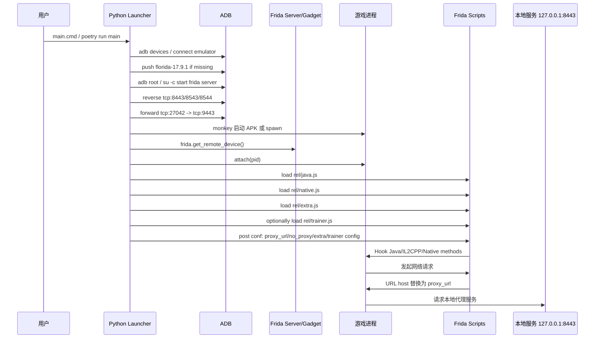

# OpenBachelorC 游戏注入过程分析报告

分析对象：`/Users/chino/Downloads/OpenBachelorC`

## 1. 结论概览

这个项目本质上是一个 **Frida 注入式游戏客户端/启动器**。

Python 侧负责：

- 找到 Android 设备或模拟器；
- 部署并启动 Frida Server，或连接 Frida Gadget；
- 建立 ADB reverse / forward 端口映射；
- 启动或附加游戏进程；
- 加载 `rel/java.js`、`rel/native.js`、`rel/extra.js`、`rel/trainer.js` 这些 Frida 脚本。

Frida JS 侧负责：

- Java 层 hook；
- IL2CPP / Unity Native 层 hook；
- 网络请求重写到本地代理；
- 证书校验绕过；
- 资源签名校验绕过；
- 可选的战斗 UI 增强和 trainer 功能。

默认配置下：

- 使用 root + Frida Server；
- 目标包名是 `com.hypergryph.arknights`；
- 会启用 `extra.js`；
- 不启用 `trainer.js`。

---

## 2. 入口与整体执行链路

用户通常运行：

```bat
main.cmd
```

其内容是：

```bat
python -m pipx run poetry run main
pause
```

对应 Python 入口：

```text
src/launcher/openbachelorc/main.py
```

核心流程在 `main()`：

1. `setup_config()` 读取命令行参数；
2. 如果不是 PC attach 模式，就寻找 Android 设备；
3. `setup_game()` 准备注入环境；
4. `setup_cli()` 进入交互式 trainer 命令行；
5. 退出时清理 Frida Server 和端口转发。

关键代码位置：

- `src/launcher/openbachelorc/main.py:57-76`
- `src/launcher/openbachelorc/main.py:97-137`
- `src/launcher/openbachelorc/main.py:202-221`

---

## 3. 目标进程与配置模式

配置文件：

```text
conf/config.json
```

默认关键配置：

```json
{
  "host": "127.0.0.1",
  "port": 8443,
  "multiplayer_port": 8543,
  "icebreaker_port": 8544,
  "no_proxy": false,
  "attach_pc": false,
  "frida_port": 9443,
  "gadget_port": 10443,
  "use_su": true,
  "use_gadget": false,
  "use_emulated_realm": false,
  "no_spawn": true,
  "enable_extra": true,
  "enable_trainer": false
}
```

目标包名由 `use_gadget` 决定：

```python
if config["use_gadget"]:
    PACKAGE_NAME = "anime.pvz.online"
else:
    PACKAGE_NAME = "com.hypergryph.arknights"
```

含义：

- `use_gadget = false`：走 Frida Server，目标是 `com.hypergryph.arknights`；
- `use_gadget = true`：走 Frida Gadget，目标是 `anime.pvz.online`。

值得注意的是，README 写的是 “PvZ Online”，但默认非 Gadget 模式实际注入的是 `com.hypergryph.arknights`。

关键代码位置：

- `conf/config.json`
- `src/launcher/openbachelorc/const.py:1-7`

---

## 4. Android / 模拟器注入准备

### 4.1 发现设备

项目先执行：

```bash
adb devices
```

如果没有发现设备，会尝试连接常见模拟器端口：

- MuMu：`127.0.0.1:16384`、`16416`、`16448`、`16480`
- 雷电：`127.0.0.1:5555`、`5557`、`5559`、`5561`

关键代码位置：

- `src/launcher/openbachelorc/adb.py:30-63`

### 4.2 上传 Frida Server

如果设备上不存在：

```text
/data/local/tmp/florida-17.9.1
```

项目会根据 ABI 选择：

- `frida-server/frida-server-17.9.1-android-arm64.xz`
- `frida-server/frida-server-17.9.1-android-x86_64.xz`

解压后写入 `tmp/frida-server`，再 `adb push` 到设备。

它还会把 Frida Server 二进制里的：

```text
frida-agent-<arch>.so
```

替换成：

```text
florida-123-<arch>.so
```

这是一个轻度改名 / 规避特征处理。

关键代码位置：

- `src/launcher/openbachelorc/adb.py:18-27`
- `src/launcher/openbachelorc/adb.py:76-134`

### 4.3 启动 Frida Server

默认 `use_su = true`，root 命令会包装成：

```bash
su -c <cmd>
```

Frida Server 启动命令形态：

```bash
nohup '/data/local/tmp/florida-17.9.1' -l 127.0.0.1:9443 -D -P -C > /dev/null 2>&1 &
```

也就是设备端 Frida Server 监听：

```text
127.0.0.1:9443
```

关键代码位置：

- `src/launcher/openbachelorc/adb.py:159-180`
- `src/launcher/openbachelorc/adb.py:201-218`

### 4.4 ADB 端口映射

项目建立两类端口映射。

游戏访问宿主机服务：

```bash
adb reverse tcp:8443 tcp:8443
adb reverse tcp:8543 tcp:8543
adb reverse tcp:8544 tcp:8544
```

本机 Frida 客户端连接设备 Frida Server：

```bash
adb forward tcp:27042 tcp:9443
```

如果是 Gadget 模式，则是：

```bash
adb forward tcp:27042 tcp:10443
```

关键代码位置：

- `src/launcher/openbachelorc/main.py:105-126`
- `src/launcher/openbachelorc/adb.py:221-252`

---

## 5. 启动 / 附加游戏进程

核心文件：

```text
src/launcher/openbachelorc/inject.py
```

### 5.1 非 Gadget 默认模式

默认配置：

```json
{
  "use_gadget": false,
  "no_spawn": true
}
```

流程：

1. 等待本地 `127.0.0.1:27042` 可访问；
2. `frida.get_remote_device()` 连接远程 Frida；
3. 通过 `adb shell monkey -p <PACKAGE_NAME>` 启动游戏；
4. 枚举进程；
5. 找名字包含 `arknights` 或 `明日方舟` 的进程；
6. 对该进程 attach。

关键代码位置：

- `src/launcher/openbachelorc/inject.py:78-118`
- `src/launcher/openbachelorc/adb.py:276-285`

### 5.2 spawn 模式

如果把 `no_spawn` 改成 `false`，则不先 monkey 启动，而是：

```python
pid = device.spawn(PACKAGE_NAME)
...
device.resume(pid)
```

这类模式更适合早期注入。

关键代码位置：

- `src/launcher/openbachelorc/inject.py:105-117`
- `src/launcher/openbachelorc/inject.py:167-169`

### 5.3 Gadget 模式

如果 `use_gadget = true`：

1. 先启动 APK；
2. `pid = "Gadget"`；
3. 等待 `127.0.0.1:27042`；
4. `frida.get_remote_device()`；
5. attach 到 Gadget。

关键代码位置：

- `src/launcher/openbachelorc/inject.py:96-104`

### 5.4 PC attach 模式

`main_attach_pc.cmd` 会传：

```bat
--attach_pc
```

这时：

- 不准备 Android 模拟器；
- 不启动 Frida Server；
- 先 `adb kill-server`；
- 直接把 pid 视作 `"Gadget"`；
- 连接本地 `27042`。

PC 侧还有一个 `setup_pc.py`，会修改 Windows 版游戏目录中的 `hgsdk.dll`：

1. 选择 `Arknights.exe`；
2. 备份 `hgsdk.dll` 为 `.bak`；
3. 解压 `frida-gadget-17.9.1-windows-x86_64.dll.xz` 为 `florida-17.9.1.dll`；
4. 用 LIEF 给 `hgsdk.dll` 增加对 `florida-17.9.1.dll` 的 import；
5. 添加入口 `_frida_application_query_options_deserialize`。

这是典型的 DLL import 注入 / side-load 链路。

关键代码位置：

- `src/launcher/openbachelorc/main.py:206-210`
- `src/launcher/openbachelorc/inject.py:86-93`
- `src/launcher/openbachelorc/setup_pc.py:17-53`

---

## 6. Frida 脚本加载机制

Python 侧固定加载这些脚本：

```text
rel/java.js
rel/native.js
rel/extra.js
rel/trainer.js
```

其中：

- `java.js`：Java 层 hook；
- `native.js`：IL2CPP / Native 层 hook；
- `extra.js`：额外 UI / 战斗体验修改；
- `trainer.js`：交互式 trainer，默认关闭。

加载过程：

1. `device.attach(pid)`；
2. `session.create_script(script_str)`；
3. `script.load()`；
4. 通过 `script.post({"type": "conf", "k": ..., "v": ...})` 下发配置。

关键代码位置：

- `src/launcher/openbachelorc/inject.py:13-18`
- `src/launcher/openbachelorc/inject.py:37-55`
- `src/launcher/openbachelorc/inject.py:121-171`

---

## 7. Java 层注入行为：`rel/java.js`

`rel/java.js` 没有源码，原始 TS 文件是 `.encrypted`。当前目录没有发现解密用的 `key_v1.png`，所以此处基于打包后的 bundle 做轻量反混淆阅读。

### 7.1 接收 Python 配置

脚本内部监听：

```js
recv("conf", ...)
```

收到：

- `proxy_url`
- `no_proxy`
- `invoke`

普通配置写入 Map；`invoke` 用于调用注册命令。

### 7.2 禁用 / 绕过部分 SDK 行为

它 hook 了：

- `com.hypergryph.eventlog.utils.Utils._GetOAID`
- `com.hypergryph.gamebi.Utils._GetOAID`
- `com.reyun.tracking.sdk.Tracking.activation`
- `com.hypergryph.platform.hgsdk.common.utils.Util.check`
- `com.hg.sdk.MTPProxyApplication.onProxyCreate`
- `com.hg.sdk.MTPDetection.onUserLogin`

这些行为看起来用于：

- 降低设备标识采集；
- 禁用部分统计 / 追踪；
- 绕过平台 SDK 检查；
- 禁用部分代理 / 检测逻辑。

### 7.3 Java 网络代理重写

关键 hook：

```js
okhttp3.HttpUrl.get(String)
```

逻辑：

- 如果 `no_proxy = true`，原 URL 不变；
- 如果 URL 以 `http://` 或 `https://` 开头：
  - 保留 path；
  - scheme + host 替换为 Python 下发的 `proxy_url`。

默认 `proxy_url` 是：

```text
http://127.0.0.1:8443
```

示例：

```text
https://example.com/path/to/api
```

会被改为：

```text
http://127.0.0.1:8443/path/to/api
```

### 7.4 Java 证书 / 明文策略绕过

它 hook 了：

- `OkHttpUtils$TrustAllCerts.checkServerTrusted`
- `NetworkService$TrustAllCerts.checkServerTrusted`
- `libcore.net.NetworkSecurityPolicy.setInstance`
- `android.security.net.config.ConfigNetworkSecurityPolicy.isCleartextTrafficPermitted`
- `com.android.org.conscrypt.TrustManagerImpl.checkTrusted`

效果：

- 允许明文 HTTP；
- 放宽证书校验；
- 使 OkHttp URL 能被改写到本地 HTTP 代理。

---

## 8. Native / IL2CPP 层注入行为：`rel/native.js`

`native.js` 主要针对 Unity / IL2CPP 层。

### 8.1 反检测 / so 加载拦截

它替换了 `android_dlopen_ext`：

```js
Interceptor.replace(android_dlopen_ext, ...)
```

当即将加载的库名包含：

- `msaoaidsec`
- `anogs`

时，直接返回上一次的 handle，不真正加载目标库。

这属于 native 层反检测 / 反 SDK 加载逻辑。

### 8.2 等待 IL2CPP 加载

脚本会检查：

- Android：`libil2cpp.so`
- Windows：`GameAssembly.dll`

发现模块后延迟执行 IL2CPP hooks。

### 8.3 IL2CPP 证书校验绕过

hook：

```text
Torappu.Network.Certificate.CertificateHandlerFactory
  .BouncyCastleCertVerifyer.IsValid(...)
```

返回：

```js
!certArray.isNull()
```

也就是只要证书数组不是 null，就认为有效。

### 8.4 UnityWebRequest 代理重写

hook：

```text
UnityEngine.Networking.UnityWebRequest.Get(System.String)
```

逻辑与 Java 层类似：

- `no_proxy = true` 时不改；
- 否则把 URL host 替换为 `proxy_url`；
- path 保留。

这说明项目同时处理：

- Java / OkHttp 发出的请求；
- Unity / IL2CPP 发出的 `UnityWebRequest` 请求。

### 8.5 资源签名校验绕过

hook：

```text
Torappu.CryptUtils.VerifySignMD5RSA(...)
```

直接返回：

```js
true
```

还 hook：

```text
System.Security.Cryptography.RSACryptoServiceProvider.VerifyHash(...)
```

直接返回：

```js
true
```

这会影响资源包、配置、热更内容等签名校验路径。

---

## 9. Extra 功能：`rel/extra.js`

默认 `enable_extra = true`，因此 `extra.js` 会被加载。

配置来自：

```json
"extra_config": {
  "pause_deploy": true,
  "3x_speed": true,
  "vision": true,
  "vision_font_size": 22
}
```

关键代码位置：

- `conf/config.json:14-20`
- `src/launcher/openbachelorc/inject.py:147-155`

### 9.1 pause_deploy

hook：

- `Torappu.UI.UISwitchToggle.SetInteractable`
- `Torappu.Battle.UI.UIController.OnBottomMaskClicked`
- `Torappu.Battle.UI.UIController.OnCardBeginDrag`

作用：

- 暂停时仍允许部分部署 / 拖拽交互；
- 执行交互前临时取消暂停；
- 操作后恢复暂停。

### 9.2 3x_speed

hook：

```text
Torappu.Battle.UI.UITopBar.OnSpeedSwitcherClicked()
```

默认速度循环从 1 / 2 扩展到 1 / 2 / 3。

### 9.3 vision

hook：

- `Torappu.Battle.UI.UIUnitHUD.Attach`
- `Torappu.Battle.UI.UIHudEnemyHpSlider.OnAttach`
- `Torappu.Battle.UI.UIEnemyGiantBossInfoPanel.Attach`

作用：

- 创建名为 `obc-vision` 的 Unity `GameObject`；
- 添加 `UnityEngine.UI.Text`；
- 使用字体 `Novecentowide-Normal`；
- 按 `vision_font_size` 设置字号；
- 将额外文字绑定到血条 / HUD 上。

从逻辑看，它用于扩展敌人 / 单位可视信息展示。

---

## 10. Trainer 功能：`rel/trainer.js`

默认关闭：

```json
"enable_trainer": false
```

可通过：

```bat
config_enable_trainer.cmd
```

或：

```bash
main --dump_json
```

开启。

Python 交互命令列表在：

```text
src/launcher/openbachelorc/main.py:27-44
```

包括：

```text
zero_cost
zero_deploy_cnt
deploy_everywhere
zero_cooldown
unlimited_token
no_sp
withdraw_everything
heal_everyone
unlimited_ammo
eat_enemy
global_range
anti_air
true_aoe
no_ban_card
cloner_assist
allow_dup_char
```

### 10.1 命令传递方式

用户在 CLI 输入：

```text
enable zero_cost
disable zero_cost
all
!dump
```

Python 会转成：

```python
{"type": "conf", "k": "invoke", "v": "enable:zero_cost"}
```

发送给 `trainer.js`。

关键代码位置：

- `src/launcher/openbachelorc/main.py:140-160`
- `src/launcher/openbachelorc/inject.py:69-75`

### 10.2 dump_json

`trainer.js` hook：

```text
Torappu.DB.AbstractTable.get_enableAsyncLoad()
Torappu.DB.DBLoader._DoLoadTable(...)
```

当 `dump_json = true` 时：

- 禁用异步加载；
- 在表加载后取 `get_data`；
- 用 Newtonsoft.Json 序列化；
- 写入 `Il2Cpp.application.dataPath/<TableName>.json`。

Python 侧再通过 ADB pull 到本地 `dump/`。

关键代码位置：

- `src/launcher/openbachelorc/dump.py:7-12`
- `src/launcher/openbachelorc/dump.py:65-98`

### 10.3 Trainer 命令效果摘要

| 命令 | 主要 hook / 效果 |
|---|---|
| `zero_cost` | `Deck.Card.get_cost`、`TokenCard.get_cost` 返回 0 |
| `zero_deploy_cnt` | `Card.get_dontOccupyDeployCnt` 返回 true |
| `deploy_everywhere` | `Tile.get_buildableType` 返回 `BuildableType.ALL` |
| `zero_cooldown` | `Card.get_state` 返回 `READY` |
| `unlimited_token` | token 数量、最大部署数、ready 状态改为近似无限 |
| `no_sp` | 友方 `Entity.get_sp` 返回高 SP，技能可用次数不耗尽 |
| `withdraw_everything` | 干员 / 陷阱可撤退 |
| `heal_everyone` | `Entity.get_isHealFree` 返回 false，扩大可治疗对象 |
| `unlimited_ammo` | `AbilityEventCounter.get_maxCount` 返回 99999 |
| `eat_enemy` | 敌人扣生命点为 0，`ModifyLifePoint` 返回 false |
| `global_range` | 扩大友方范围 collider 到极大值 |
| `anti_air` | 友方选择器 `targetMotion` 返回 `MotionMask.ALL` |
| `true_aoe` | 最大目标数改为 128，并绕过部分 post-filter |
| `no_ban_card` | `Card.get_isAvailable` 返回 true |
| `cloner_assist` | 助战 / 编队校验绕过 |
| `allow_dup_char` | 修改 uniqueId，允许重复角色进入战斗数据 |

---

## 11. 注入流程时序图



---

## 12. 关键风险点 / 特征点

1. **强依赖 Frida**
   - Android 默认是 Frida Server；
   - PC 是 Frida Gadget DLL import 注入。

2. **明显的反检测 / 绕过行为**
   - Frida Server 文件名改成 `florida-*`；
   - agent so 名称被替换成 `florida-123-*`；
   - native 层拦截 `android_dlopen_ext`，阻止部分库加载；
   - Java 层禁用 OAID、tracking、MTP 检测。

3. **网络被强制改道**
   - Java OkHttp URL 改写；
   - UnityWebRequest URL 改写；
   - 默认指向 `http://127.0.0.1:8443`；
   - ADB reverse 让设备内的 `127.0.0.1:8443` 对应宿主机服务。

4. **证书与签名校验被绕过**
   - Java TrustManager / NetworkSecurityPolicy；
   - IL2CPP CertificateHandler；
   - MD5/RSA、RSA VerifyHash。

5. **Trainer 修改战斗逻辑**
   - 不是单纯代理客户端；
   - `trainer.js` 包含大量 IL2CPP gameplay hook；
   - 默认关闭，但可通过配置打开。

---

## 13. 关于能否重新还原那几个 JS

项目里有两类 JS / TS 相关文件：

1. 已编译产物：
   - `rel/java.js`
   - `rel/native.js`
   - `rel/extra.js`
   - `rel/trainer.js`

2. 加密源码：
   - `src/script/java/index.ts.encrypted`
   - `src/script/native/index.ts.encrypted`
   - `src/script/extra/index.ts.encrypted`
   - `src/script/trainer/index.ts.encrypted`
   - 以及 `src/script/util/index.ts.encrypted`

当前目录没有发现 `locker.py` 需要的 `key_v1.png`，因此这些 `.encrypted` 文件无法直接解密。

### 13.1 不依赖 IDA Pro 的情况下

可以从 `rel/*.js` 做以下程度的还原：

- 格式化 / beautify；
- 反混淆一部分字符串；
- 提取 hook 的类名、方法名、参数签名；
- 整理成较可读的 JS；
- 甚至可以按功能手工重写出接近原逻辑的 TS。

但很难 100% 还原：

- 原始变量名；
- 原始函数拆分；
- 注释；
- TypeScript 类型；
- 模块结构；
- 编译前的工程组织。

所以从 `rel/*.js` 能做的是“语义级还原 / 重构”，不是严格意义上的“原源码恢复”。

### 13.2 有 IDA Pro 的情况下

IDA Pro 对这个项目能提供的帮助有限，取决于你想分析什么：

- 如果目标是还原 `rel/java.js`、`rel/native.js`、`rel/extra.js`、`rel/trainer.js`：
  - IDA Pro 不是主要工具；
  - 因为这些文件已经是文本 JS bundle；
  - 更有效的是 JS beautifier、AST 工具、字符串反混淆脚本、Frida API 语义分析。

- 如果目标是分析 Frida Server / Frida Gadget：
  - IDA Pro 可以分析 `frida-server`、`frida-gadget`、`florida-17.9.1.dll` 等 native binary；
  - 但这通常不能还原项目自己的 JS 源码；
  - 最多帮助理解 Gadget 加载、导出符号、连接端口、二进制改名等行为。

- 如果目标是从游戏二进制中恢复被 hook 的类型、方法、字段：
  - IDA Pro 可以辅助分析 `libil2cpp.so` / `GameAssembly.dll`；
  - 但对 Unity IL2CPP 项目而言，通常还需要 `global-metadata.dat`、Il2CppDumper、Il2CppInspector、Ghidra/IDA 脚本等；
  - 它能帮助验证 hook 目标是否真实存在、方法地址和签名是否匹配。

### 13.3 最准确的判断

在“只提供本项目 + IDA Pro”的情况下：

- **可以还原出可读度较高的 JS 逻辑版本**：可以从 `rel/*.js` 反混淆、格式化、重构；
- **不能保证还原出原始 TS 源码**：除非拿到 `key_v1.png` 或原始未加密源码；
- **IDA Pro 不是还原这些 JS 的关键工具**：它更适合分析 native binary、Frida Gadget、Frida Server、游戏 IL2CPP 二进制；
- **真正关键的还原入口是 `rel/*.js` 和 `.encrypted` 的密钥**。

如果目标是“尽量恢复源码工程”，推荐路线：

1. 对 `rel/*.js` 做 beautify；
2. 用脚本批量还原字符串混淆；
3. 按 `recv("conf")`、`Java.perform`、`Il2Cpp.perform`、`Interceptor`、`implementation` 切分功能块；
4. 提取所有 hook 目标，生成清单；
5. 手工重构为：
   - `src/script/java/index.ts`
   - `src/script/native/index.ts`
   - `src/script/extra/index.ts`
   - `src/script/trainer/index.ts`
   - `src/script/util/index.ts`
6. 如果能拿到 `key_v1.png`，优先直接用 `locker.py decrypt` 解密原始源码。

---

## 14. 一句话总结

这个项目的注入链路是：**Python 启动器通过 ADB 部署 / 连接 Frida，在游戏进程中加载多份 Frida 脚本；脚本分别在 Java、Native、IL2CPP 层 hook 网络、证书、签名、检测和战斗逻辑，从而把游戏请求导向本地 OpenBachelor 服务，并可选启用 UI 增强和 trainer 功能。**

关于 JS 还原：**只靠当前项目和 IDA Pro，能重构出较可读的功能等价 JS，但不能保证还原出原始 TypeScript 源码；原始源码恢复的关键是 `key_v1.png` 或未加密源码，而不是 IDA Pro。**
